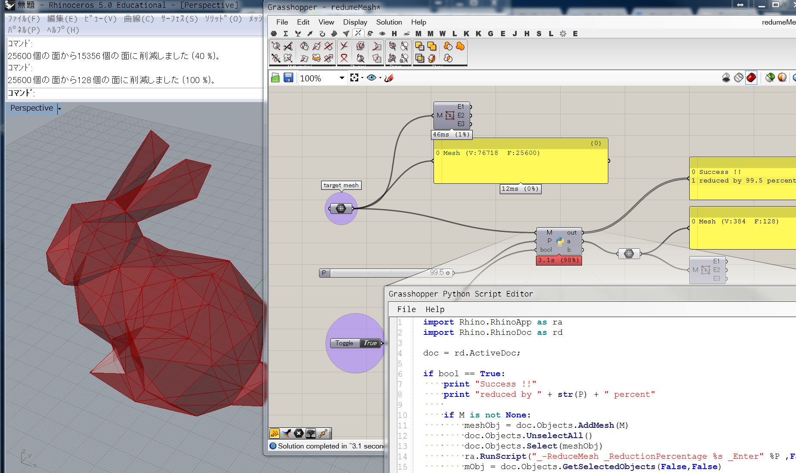

# ReduceMesh-via-ghPython  

~~grasshopper を経由することで、入出力をインタラクティブにできる。  
ReduceMesh で削減して気に入らなくて、 Undo でいちいち戻すのを避けれる（はず）。~~  
普通に ReduceMesh のときに、プレビューっていうのあった。  

まあ、grasshopper のスクリプトのどこかで、メッシュの削減を挟むときに使えるので。。。  


ghPython のコードは冗長に見えるが、フォーラムによると、Rhino の SDK の仕様的に、 RhinoApp、RhinoDoc を噛ませる必要とか書いてあるのでたぶんそういうもの。速度を比べてもそんなに遅くないのでまあ。  

```python

import Rhino.RhinoApp as ra
import Rhino.RhinoDoc as rd

doc = rd.ActiveDoc;

if bool == True:
    print "Success !!"
    print "reduced by " + str(P) + " percent"

    if M is not None:
        meshObj = doc.Objects.AddMesh(M)
        doc.Objects.UnselectAll()
        doc.Objects.Select(meshObj)
        ra.RunScript("_-ReduceMesh _ReductionPercentage %s _Enter" %P ,False)
        mObj = doc.Objects.GetSelectedObjects(False,False)
        geomOut = []
        for m in mObj:
            geomOut.Add(m.Geometry)
        doc.Objects.Delete(meshObj,True)
        a = geomOut

else:
    print "NA"

    a = M

```

  

---  


### 使い方  

Toggle を False に。  

target mesh を右クリック。Set mesh を選んで、Rhino上の meshを選択。   

スライダーで削減したい割合を指定。  

Toggle を True にすると削減が始まる。  

良ければ、 Bake  

---  

参考にしたのはこれ→
（[http://www.grasshopper3d.com/forum/topics/how-do-i-reduce-mesh-via-python](http://www.grasshopper3d.com/forum/topics/how-do-i-reduce-mesh-via-python)）  

このままだと、ghPython コンポーネントが常時走り出して、かなり不便なので、BoolToggle を付けた。  

卒制のときにここのサンプル落としてきて使おうとしたときに、そのとき作ってた Mesh が重い + Toggle を自分で付けることを思いつかなくて、ただの自動フリーズスクリプトみたいになってたので改良。（180312）  


---  

僕の手元の実行環境は、  
- windows7 (bootcamp)  
- Rhinoceros5 (Win)  
- Grasshopper (0.9.0076)  
- ghPython (0.6.0.3)  

ghPython はここから→([http://www.food4rhino.com/app/ghpython](http://www.food4rhino.com/app/ghpython))  


---  

[https://github.com/naysok/ReduceMesh-via-ghPython](https://github.com/naysok/ReduceMesh-via-ghPython)
